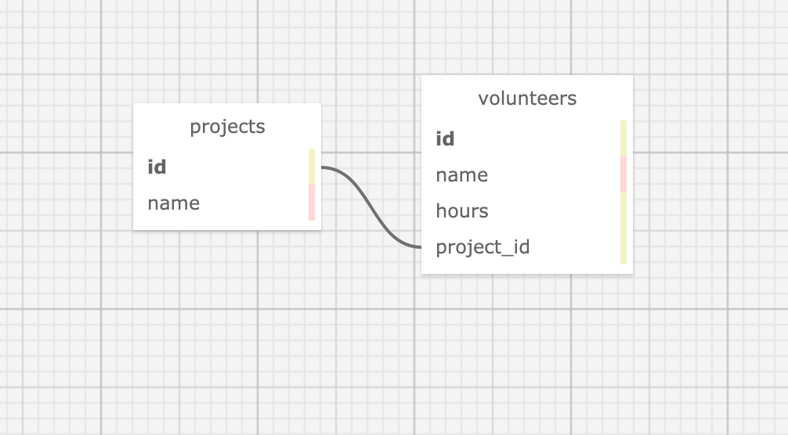

# Volunteer Tracker

#### An application that tracks projects and the volunteers working on them

#### By Araceli Valdovinos

## Technologies Used

* _Ruby_
* _Postgres_
* _Ruby Gem: rspec, pry, sinatra, sinatra-contrib, capybara, pg_
* _HTML_
* _Bootsrap\CSS_

## Description
_An application that tracks projects and the volunteers working on them. Each volunteer will belong to only one project (one project, many volunteers).The application covers the following test and user stories:_

_Test_
* _You may alter a unit test only if you are adding more attributes to volunteers or projects._
* _You may (and should) add more unit tests if you decide to add additional features or if there are any methods that aren't covered by the included tests._
* _You may alter the names of buttons and fields in the Capybara tests. You may also add additional tests._ 
* _However, your integration specs should otherwise use the current provided tests unaltered._
* _If there is an error or bug in any of the tests, you may correct that error._

_User Stories_
* _As a non-profit employee, I want to view, add, update and delete projects._
* _As a non-profit employee, I want to view and add volunteers._
*_As a non-profit employee, I want to add volunteers to a project._

_Schema_

## Setup/Installation Requirements
* _This project uses postgres, inorder to download use the following link: [Postgres Download](https://www.postgresql.org/download/)_
* _To recreate the database enter the following command in the terminal/command line:_
    * _createdb [volunteer_tracker]_
    * _psql [volunteer_tracker] < database_backup.sql_
    * _createdb -T [volunteer_tracker] [volunteer_tracker_test]_
* _Clone that repository down to your desktop._
* _Navigate to the cloned folder and run `bundle install` in the terminal/command line to download dependencies_
* _Open cloned folder in the editor of your choice_
* _To run test use `rspec` on the root directory of the cloned project command line_
* _To run app in browser use `ruby app.rb` on the root directory of the cloned project command line, then enter `http://localhost:4567` in the browser_

## Known Bugs/Goals
* _When adding a volunteer to the project an extra blank field is generated_
* _I would like to add the further exploration for hours_
* _I rewrote update method, I need work on existing update method to make it pass_

## License
_[MIT](https://opensource.org/licenses/MIT) (c) 2021 Araceli Valdovinos_

## Contact Information
_Araceli Valdovinos araceli.valdovinos@outlook.com_
